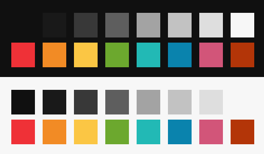

# v2.00.02 -- Маленькие цвета

> Неделя затянулась, я подступался ко второй части курса по Pong с разных сторон. Потом понял, что статья разрастается в большой нудный утомительный комок, и решил максимально дробить информацию. Хочется сделать по настоящему хорошие материалы, что без проб и ошибок похоже не реально.
>
> Поборол свой страх перед цветами и ушел от готовых цветовых схем. Получилось лучше, чем ожидал, но шлифовать еще нужно.
>
> 
>
> Сумбурно, да (ᵔ.ᵔ) 
>
> @[passazhir](https://github.com/passazhir)

- Исправления CSS (стили списков)
- Изменена цветовая схема. Вместо Chalk, пришла своя, пока не отшлифованная тема.
- Исправлены названия и цвета картинок из [первой части](/sup/lvl01/ch01) [первого курса](/sup/lvl01) по Superpowers
- Добавлена [вторая часть](/sup/lvl01/ch02) [первого курса](/sup/lvl01) по Superpowers
