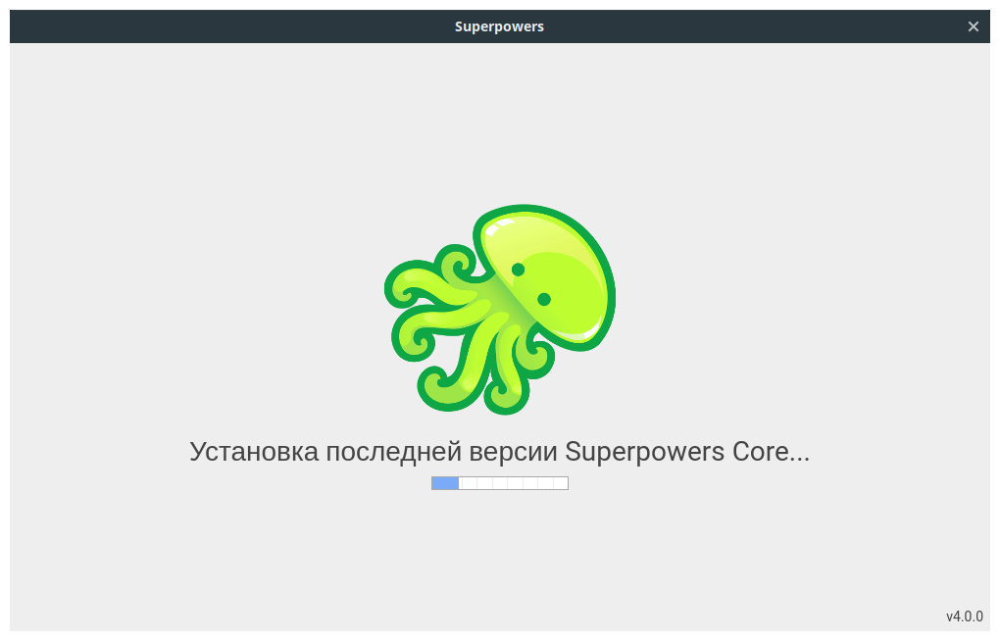
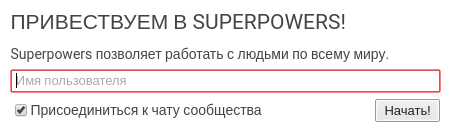

# 1 \ Подготовка Superpowers

Прежде чем приступить к разработке нашей первой игры, нужно подготовить движок. Разные движки устанавливаются по разному, но **Superpowers** в этом плане максимально прост. Сейчас сами все увидите (и не забывайте пробовать).

## 1.1 \ Установка

**Superpowers** распространяется через популярный сервис [**itch.io**](https://itch.io/) абсолютно бесплатно и доступен для **Windows**, **macOS** и **Linux**.

Есть три способа установить этот движок на ваш компьютер:

- Через сайт **itch.io**
- Через приложение **itch.io**
- Собрать из исходников

Мы рассмотрим только первые два варианта.

### 1.1.1 \ Через сайт

Заходим на страницу [**Superpowers**](https://sparklinlabs.itch.io/superpowers) в вашем браузере и нажимаем кнопку **``Download Now``**. После этого перед вами появится следующее окно:

Движок можно использовать совершенно бесплатно, но помните, что за его разработкой стоят реальные люди, которые тратят на него свое время и силы. Лучший способ сказать им спасибо и поддержать развитие этого инструмента - заплатить за него сколько вам не жалко. Для этого в поле _[2]_ введите сумму (которую не жалко :)) и выберите удобный способ оплаты _[3]_. Затем пройдите процедуру оплаты соответствующую вашему выбору.

Если сейчас у вас нет возможности материально поддержать разработку, можете просто нажать на верхнюю ссылку _[1]_. В обоих случаях вы попадете на страницу выбора версии для скачивания. Найдите соответствующую вашей системе и нажмите кнопку **Download**.

> Тут вы можете заметить, что команда **Superpowers** подготовила для вас огромный пакет бесплатных и свободных ассетов **Superpowers Mega Asset Pack (1200+ files!)** (набор картинок для создания ваших игр), которые вы можете скачать с этой же страницы. Вот ведь молодцы!)

Полученные файлы установите также, как и любую другую программу в вашей системе.

### 1.1.2 \ Через приложение

Чтобы установить движок через **приложение itch.io**, сперва нужно скачать и установить это приложение (доступно для **Windows**, **macOS** и **Linux**). Заходим на [эту страницу](https://itch.io/app) и нажимаем **Download Now**, а затем устанавливаем скачанный файл. Запускаем приложение **itch** регистрируемся и входим. Теперь в поле **Поиск** вводим ``Superpowers`` и находим нужную страницу:

Попав на страницу движка, справа вы увидите кнопки управления приложением:

Нажав на кнопку **Поддержать разработчика** _[2]_ вам откроется форма, в которой вы можете выбрать сумму и способ, чтобы перевести немного денег за/на разработку движка. После нажатия кнопки **Установить** _[1]_ и, в случаи Windows или Linux, выбора 32 или 64 битной версии начнется автоматическая установка **Superpowers** на ваш компьютер.

## 1.2 \ Первый запуск

Давайте уже запустим движок и почувствуем Супер-силу!

> При первом запуске убедитесь, что компьютер **имеет доступ в интернет**. Superpowers будет автоматически скачивать дополнительные системы. 

Найдите ярлык установленного Superpowers в вашей системе, если скачивали его с сайта, и запустите его.

Если устанавливали через приложение, откройте его, нажмите на вкладку **Библиотека** _[1]_, выберите Superpowers и нажмите кнопку **Запустить** _[2]_.

При первом запуске начнется скачивание основной системы - **Superpowers Core**:

Это займет некоторое время, после чего появится окно приветствия с предложением ввести ваше имя пользователя:

Имя пользователя будет отображаться во встроенном официальном IRC-чате. Но вы можете и отказаться от него, сняв соответствующую галочку в этом окне. Хорошо, вводим имя и жмем **Начать!** Появится окно предлагающее загрузить систему **Superpowers Game**.

> Приложение, которое мы установили ранее, это не сам движок, а лаунчер для запуска и обновления систем:
> - **superpowers-core** - основная система.
> - **superpowers-game** - движок для создания 3D и 2D HTML5 игр.
> - **superpowers-love2d** - реализация движка LÖVE 2D в Superpowers.
> - **superpowers-web** - движок для создания статичных веб-сайтов.
> 
> Мы разберем работу только с двумя основными системами **superpowers-core** и **superpowers-game**.

Ради этого мы тут и собрались, потому не задумываясь жмем **Установить**. Придется еще немного подождать, после чего вы увидите два информационных окна, которые рассказывают о серверах для работы с движком. Они дают возможность работать удаленно через браузер и совместно с другими людьми. Но мы рассмотрим сервера в отдельной статье, сейчас вам достаточно информации из этих двух окон.

Разберем интерфейс лаунчера:

- _[1]_ Ваше ник в чате, нажав на который, откроется окно для его редактирования.
- _[2]_ Кнопка для смены вашего статуса в чате.
- _[3]_ Кнопка для добавления еще одного сервера.
- _[4]_ Кнопка для изменения сведений о сервере: название, ip, порт (чтобы несколько запущенных серверов не пересекались друг с другом).
- _[5]_ Кнопка для удаления сервера.
- _[6]_ Ваш сервер.
- _[7]_ Кнопка для запуска/остановки сервера.
- _[8]_ Открывает расширенные настройки сервера. Тут вы можете обновлять или устанавливать новые системы или разрешать доступ к серверу из интернета. Редактировать эти настройки можно только при остановленном сервере.
- _[9]_ Приветственная вкладка.
- _[10]_ Вкладка чата.
- _[11]_ Полезные ссылки.
- _[12]_ Новости Superpowers.

### 1.2.1 Открываем сервер

Убедимся, что наш сервер запущен и дважды нажмем на него. Откроется новая вкладка, которая предложит ввести ваше имя **для этого сервера** (напомню, что вы можете работать с другими людьми на одном сервере). В верхней строке вкладки сервера вы можете увидеть кнопку для создания **нового проекта** _[1]_ и для смены языка интерфейса на сервере _[2]_ (по умолчанию русский):

> _Ранее я осуществил перевод интерфейса Superpowers на русский и планирую в свободное время поддерживать его актуальность. Но в этом курсе мы будем придерживаться английской версии, чтобы не зависеть от обновлений перевода. Там нет сложного английского, потому перевод - вопрос эстетики._
>
> @passazhir

### 1.2.2 Создаем проект

Сейчас список наших проектов пуст, давайте нажмем кнопку **New project** _(Новый проект)_:

Введем имя (Project name) и если хотите описание (Description), а если нажать на картинку осьминога, можно поменять иконку проекта. В поле типа оставим **Empty project** _(Пустой проект)_, а также оставим галочку на против **Open after creation** _(Открыть после создания)_. Нажимаем кнопку **Create** _(Создать)_ и перед нами откроется окно нашего нового проекта.

> Заметьте, что главная вкладка проекта - это чат для людей, которые работают над ним. Но сейчас мы тут одни :)

## 1.3 Итог

Итак, мы установили Superpowers с нужными системами и создали первый проект. В следующей части начнем создавать нашу первую игру - **Pong**.
