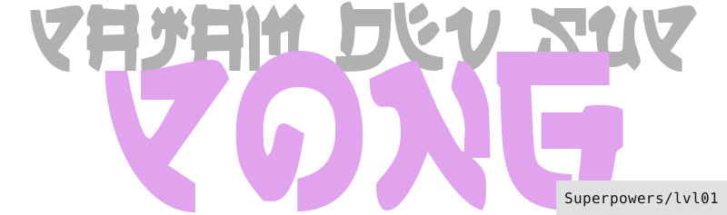

---

_Открывать игрокам окна в придуманные вами миры. Дать им возможность пережить какой-то опыт. Рассказывать истории и делиться мыслями, позволяя взаимодействовать с ними._ Звучит круто? Но все не так просто в создании игр. Есть много технических деталей, с которыми нужно уметь работать.

Именно ими мы займемся в этих курсах. Создадим свои интерпретации простых и известных игр на движке **Superpowers**, такими образом разберем общие принципы разработки игр и работу с конкретно этим инструментом. Разработка игр не элементарное занятие. Так же как с ездой на велосипеде, не стоит сразу решаться на спуск с крутой горы или лавирование в густом потоке машин. Вместе с этими курсами, начните с малого и постепенно оттачивайте свои навыки. Это поможет вам не разочароваться, при столкновении со стеной задач, с которой вы не сможете справиться только из-за недостатка опыта. Наберитесь терпения и вскоре реализация ваших задумок не будет непосильной задачей.

В этом курсе мы установим **Superpowers**, познакомимся с интерфейсом и создадим игру **Понг**.

> Понг первая массовая графическая видео-игра. Обладая простейшим геймплэеем, она стала символом зарождения всей индустрии видео-игр и обрела широчайшую известность.
>
> [Статья на Википедии][1]

Наша версия будет позволять двум игрокам играть друг против друга за одной клавиатурой, или могут соревноваться левая и правая рука одного игрока.

Готовы начать?

---

- Основано на [курсе][2] от [Michaël Seyne][3]
- Адаптация [@passazhir][4]

[1]: https://ru.wikipedia.org/wiki/Pong_(%D0%B8%D0%B3%D1%80%D0%B0)
[2]: https://github.com/mseyne/superpowers-tutorials/tree/master/1SuperPong
[3]: https://github.com/mseyne
[4]: https://github.com/passazhir
