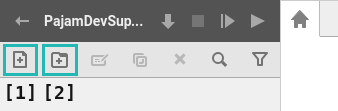
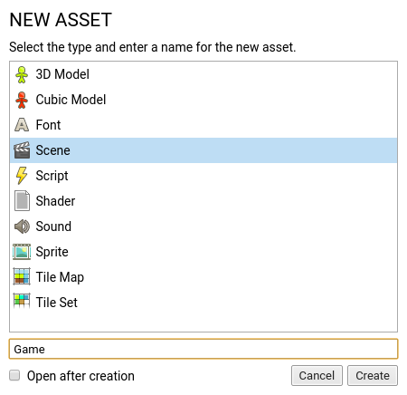
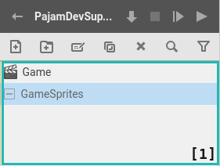
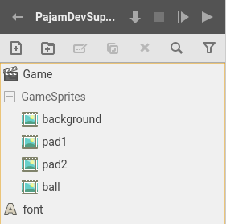

# 3 \ Game > Создаем ассеты

Вернемся к окну проекта и создадим ассеты для сцены **Game**. И начнем мы с самой сцены _(Cцены считаются ассетами, ведь это тоже ресурс)_.

Чтобы создать ассет нажмите кнопку **``New asset``** _(Создать ассет) [1]_  или клавиши ``Ctrl + n``.

Перед вами откроется окно, где вам нужно выбрать тип создаваемого ассета и ввести его имя _(Asset name)_. Выбираем тип **Scene** _(Сцена)_ и называем его **Game**, затем нажимаем ``Create`` _(Создать)_.

Обычно, в проектах мы создаем множество ассетов и вы можете использовать папки, чтобы внести немного порядка. Давайте создадим папку для **спрайтовых** ассетов сцены **Game**. Нажмите кнопку **``New folder``** _(Новая папка) [2]_ или клавиши ``Ctrl + Shift + n``.

В появившемся окне введите имя папки ``GameSprites`` и нажмите ``Create``.

Выберите созданную папку в **списке ассетов** _[1]_ и создайте в ней четыре ассета с типом **Sprite** _(Спрайт)_, назвав их ``background``, ``pad1``, ``pad2`` и ``ball``.

Также в корне списка создайте ассет типа **Font** _(Шрифт)_, назвав его просто ``font``. Он пригодится для отображения счета. 

> Вы можете перемещать ассеты по списку, перетаскивая их мышкой.

В результате у вас должно получиться так:

