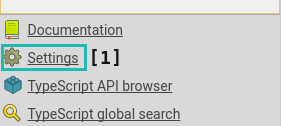
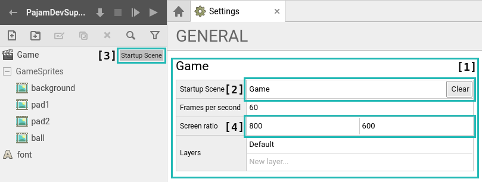

# 4 \ Настройка проекта

Теперь отвлечемся от ассетов и изменим пару деталей в настройках нашего проекта. Нажмите кнопку ``Settings`` _(Настройки) [1]_, чтобы открыть вкладку с настройками.

Сейчас, в открывшейся вкладке, нам нужен только раздел **GENERAL** _(Основное)_ > **Game** _(Игра)_ _[1]_.

## 4.1 \ Начальная сцена

Сначала установим **Startup Scene** _(Начальная Сцена)_ _[2]_, для этого перетащите сцену **Game** в это поле или нажмите ``Select`` _(Выбрать)_ и в открывшемся списке выберите эту сцену. После этого у сцены, в списке ассетов, появится ярлык **Startup Scene** _(Начальная Сцена)_ _[3]_.

> **Начальная сцена** - сцена, которая запускается после старта приложения. Затем, при выполнении какого-то условия, вы переводите игрока на другую сцену и т.д. Изменение начальной сцены поможет вам при тестировании игры, чтобы не проходить все уровни до нужного, вы можете указать сцену на которую попадете при старте.

Теперь, при запуске тестирования игры, мы окажемся сразу в сцене **Game**.

## 4.2 \ Соотношение экрана

Также нам нужно установить стандартное разрешение игры, чтобы оно равнялось размерам ассетов фонов, которые будут закрывать весь игровой экран. Их разрешение - **800px на 600px**.

Найдите в настройках пункт **Screen ratio** _(Соотношение экрана)_ _[4]_ и установите **Width** _(Ширина)_ на ``800``, а **Height** _(Высота)_ на ``600``.
