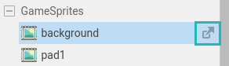

# 5 \ Game > Загрузка ассетов

Ранее созданные нами ассеты похожи на коробки, которые содержат изображения, шрифты, сцены и т.д. Но сейчас они пустые, давайте их наполним.

Сначала скачайте необходимые файлы из нашего [GitHub репозитория](https://github.com/pajamhub/dev_assets/tree/master/sup/lvl01).

Дважды нажмите на GameSprites/**background** в списке ассетов, в новой вкладке откроется редактор этого ассета спрайта.

> Когда вы наводите на элемент в списке ассетов, у него появляется дополнительная кнопка. Нажатие этой кнопки откроет редактор ассета в отдельном окне. Это пригодится, если вам нужно, например, переместить этот редактор на второй монитор или просто организовать работу через окна, а не вкладки.
>
> 

В левой части редактора расположены: сверху окно пред-просмотра загруженного спрайта с сеткой на нем, снизу его отображение в сцене и анимации. А в правой части вы увидите настройки ассета.

## 5.1 \ Первый ассет

Сначала нам нужно загрузить, ранее скачанный спрайт, в проект. Для этого нажмите кнопку **Upload** _(Загрузить)_ _[1]_ и выберите файл GameSprites/**background.png**.

> В окнах пред-просмотра вы можете отдалять и приближать изображение с помощью колесика мыши. А перемещать обзор зажав колесико мыши или Alt + Левая кнопка мыши.

Если посмотрите на на верхнее окно пред-просмотра, то заметите что спрайт поделен сеткой _[1]_. А в низу отображается только часть спрайта _[2]_. 

Сетка помогает, когда на спрайте расположены сразу несколько кадров анимации. Но это не наш случай. Чтобы фон отображался целиком изменим параметры сетки. В свойствах ассета находим пункт **Sprite** _(Спрайт)_ / **Grid Size** _(Размер Сетки)_:

Вы можете ввести значения равные размерам картинки ``800``/``600`` или нажать **Setup** _(Установить)_ затем вести количество кадров в строке (у нас ``1``) и кадров в столбце (``1``). Теперь в нижнем окне пред-просмотра вы увидите все изображение целиком.

### 5.1.1 \ Другие свойства

Быстро пробежимся по другим важным свойствам, о которых нужно знать, но сейчас менять мы их не будем.

**Sprite** / **Origin** _(Основа)_ - определяет место положения точки основы спрайта. От этой точки будут считаться координаты, рассчитываться перемещение и т.д. Оставляем на ``50`` / ``50``, иначе говоря **по середине**. 

**Rendering** _(Отображение)_ / **Pixels/unit** _(Пиксели/единица)_ - Не которые вычисления в движке происходят в единицах. Этот параметр определяет сколько пикселей этого спрайта в единице измерения. Оставляем ``100``.

Если пока вам эти параметры не до конца ясны, не пугайтесь в процессе все станет яснее.

В результате у вас получатся такие настройки ассета **background**:

## 5.2 \ Другие ассеты

Аналогично загрузите другие спрайтовые ассеты, имена фалов соответствую именам ассетов. Не забудьте проверить, что размер сетки равен размеру изображения, Основа находится по середине, а в единице 100 пикселей.

## 5.3 \ Ассет шрифта

Откройте ассет **Font**. Перейдем сразу в свойства:

- **Font Type** _(Тип Шрифта)_ оставляем на **Vector Font** _(Векторный шрифт)_
- Загружаем ранее скачанный из репозитория файл **YamaMotoCondensed.ttf**
- Rendering / **Pixels/Unit** устанавливаем на ``200``
- Settings _(Настройки)_ / **Size** _(Размер)_ выберем ``128``

Должно получится так:

## 5.4 / Итог

У нас есть все нужные ресурсы, можем начать строить сцену.
